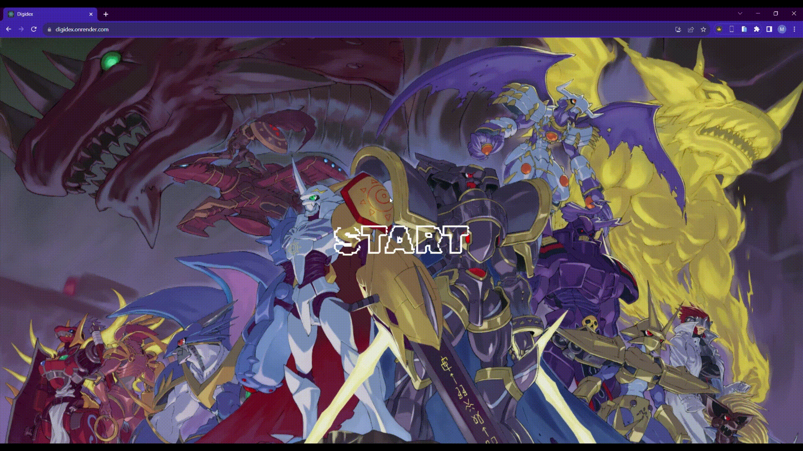

# Digidéx

Pagination-enabled application containing 1422 Digimons, which you can search by ID. You can also add a new Digimon! Additionally, it features a favorites section to add your most liked Digimons and a details section for each Digimon when you click on their image. Finally, you can use it on any device. I hope you enjoy this website!


# Features
- Favorites
- Search
- Add Digimon
- Filtering and ordering of data
- Detail


# Stack
_ React
_ Redux Toolkit
_ TailwindCss
_ CSS Modules


## Screenshots

**Start**




**Detail**


**Favorites**


**Add Digimon**


**Mobile Responsive**


**Tablet Responsive**


## Installation

1.- Clone the repo.

```bash
  git clone https://github.com/MauricioAlonso28/DIGIDEX.git
```

2.- Install dependencies.

```bash
  npm install
```

3.- Run npm start in the terminal

```bash
    npm start
```
